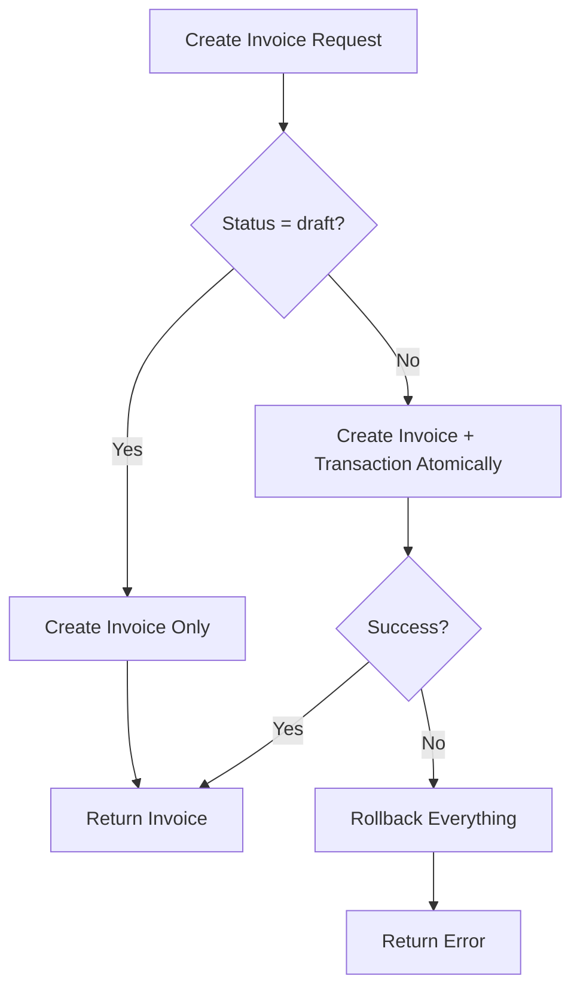
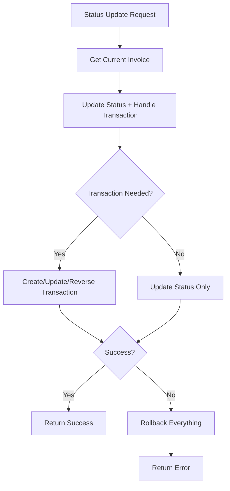
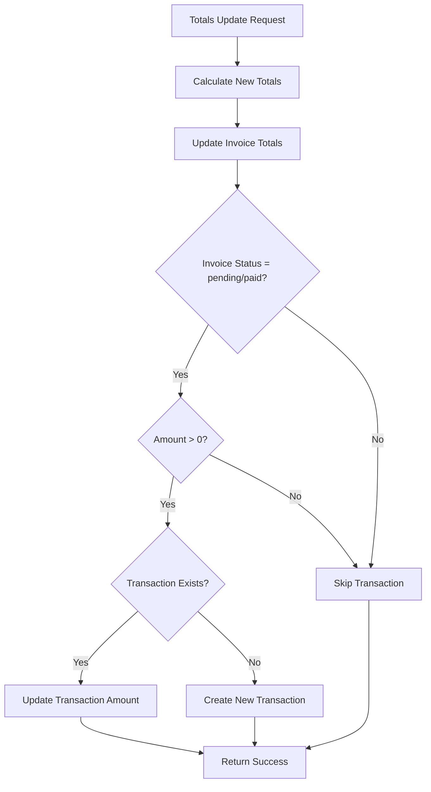

# Atomic Transaction System Documentation

## Overview

The Atomic Transaction System ensures data integrity between invoices and transactions by implementing database-level atomic operations. This system guarantees that invoice status changes and transaction creation/reversal happen as a single, indivisible operation - either both succeed or both fail completely.

## Problem Solved

**Before**: Invoice status updates and transaction creation were separate operations, leading to potential data inconsistency where:
- An invoice could be marked as "pending" without a corresponding transaction
- User account balances could be incorrect
- System state could be inconsistent if one operation failed

**After**: All invoice and transaction operations are atomic, ensuring:
- Every invoice with non-zero amount has a corresponding transaction
- User account balances are always accurate
- System state is always consistent

## Architecture

### Database Functions (PostgreSQL)

#### 1. `update_invoice_status_atomic(p_invoice_id, p_new_status, p_updated_at)`

**Purpose**: Updates invoice status and handles transaction creation/reversal atomically.

**Parameters**:
- `p_invoice_id` (UUID): Invoice ID to update
- `p_new_status` (TEXT): New status (draft, pending, paid, cancelled, etc.)
- `p_updated_at` (TIMESTAMPTZ): Update timestamp

**Returns**: JSONB with success status, transaction details, and error information

**Status Transitions Handled**:
- `draft → pending/paid`: Creates debit transaction
- `pending/paid → cancelled`: Creates reversal (credit) transaction
- `cancelled → pending/paid`: Creates new debit transaction

**Example**:
```sql
SELECT update_invoice_status_atomic(
  'invoice-uuid-here'::uuid,
  'pending'::text,
  NOW()
);
```

#### 2. `create_invoice_with_transaction(p_user_id, p_booking_id, p_status, p_invoice_number, p_tax_rate, p_due_date)`

**Purpose**: Creates invoice and transaction atomically for non-draft invoices.

**Parameters**:
- `p_user_id` (UUID): User ID for the invoice
- `p_booking_id` (UUID, optional): Associated booking ID
- `p_status` (TEXT): Initial status (draft, pending, paid)
- `p_invoice_number` (TEXT, optional): Custom invoice number
- `p_tax_rate` (NUMERIC): Tax rate (default 0.15)
- `p_due_date` (TIMESTAMPTZ, optional): Due date

**Returns**: JSONB with invoice ID, transaction ID (if created), and status

**Behavior**:
- Creates invoice with specified status
- Only creates transaction for pending/paid invoices with non-zero amounts
- For zero-amount invoices, transaction is created when totals are updated

#### 3. `update_invoice_totals_atomic(p_invoice_id)`

**Purpose**: Updates invoice totals and syncs transaction amounts atomically.

**Parameters**:
- `p_invoice_id` (UUID): Invoice ID to update

**Returns**: JSONB with updated totals and transaction information

**Behavior**:
- Calculates totals from invoice items
- Updates invoice subtotal, tax_total, total_amount, balance_due
- Creates or updates associated transaction for non-draft invoices
- Only creates transactions for non-zero amounts

### Application Layer Integration

#### InvoiceService Class

**Updated Methods**:

1. **`updateInvoiceStatus(invoiceId, newStatus)`**
   - Now uses `update_invoice_status_atomic()` database function
   - Handles all error cases and rollback scenarios
   - Provides detailed logging of status changes and transaction creation

2. **`updateInvoiceTotalsWithTransactionSync(invoiceId)`**
   - Now uses `update_invoice_totals_atomic()` database function
   - Ensures transaction amounts stay in sync with invoice totals
   - Creates transactions when invoice totals become non-zero

#### API Endpoints

**POST `/api/invoices`**
- Uses `create_invoice_with_transaction()` for atomic invoice creation
- Handles both draft and non-draft invoice creation
- Provides detailed error handling and logging

**PATCH `/api/invoices/[id]`**
- Uses `update_invoice_status_atomic()` for status changes
- Separates status updates from other field updates
- Ensures atomicity for all status-related operations

## Data Flow

### Invoice Creation Flow



### Status Update Flow



### Totals Update Flow



## Error Handling & Rollback

### Database-Level Rollback

All database functions use PostgreSQL's built-in transaction system:

```sql
BEGIN
  -- All operations here
  -- If any error occurs, everything rolls back
EXCEPTION
  WHEN OTHERS THEN
    -- Return error details
    -- Automatic rollback happens
END;
```

### Application-Level Error Handling

```typescript
try {
  const result = await supabase.rpc('atomic_function', params);
  if (!result.success) {
    throw new Error(result.error);
  }
} catch (error) {
  // Handle error and return appropriate response
}
```

## Transaction Types & Metadata

### Transaction Types

1. **`debit`**: Invoice charges (user owes money)
2. **`credit`**: Payments and reversals (user pays money)

### Metadata Structure

```json
{
  "invoice_id": "uuid",
  "invoice_number": "INV-2025-09-001",
  "transaction_type": "invoice_debit",
  "reversal_of": "uuid", // For reversals
  "reversal_reason": "Invoice cancelled" // For reversals
}
```

## Database Constraints

### Existing Constraints Respected

1. **`transactions_amount_not_zero`**: Prevents zero-amount transactions
2. **`invoices_amounts_positive`**: Ensures positive invoice amounts
3. **`invoices_tax_rate_positive`**: Ensures positive tax rates

### Data Integrity Guarantees

1. **Atomic Operations**: All related operations succeed or fail together
2. **Consistency**: Invoice status and transaction state always match
3. **Isolation**: Concurrent operations don't interfere with each other
4. **Durability**: Committed changes are permanent

## Testing & Verification

### Test Scenarios

1. **Invoice Creation**:
   - Draft invoice (no transaction)
   - Pending invoice (creates transaction when totals set)
   - Paid invoice (creates transaction when totals set)

2. **Status Updates**:
   - Draft → Pending (creates transaction)
   - Pending → Cancelled (reverses transaction)
   - Cancelled → Pending (recreates transaction)

3. **Totals Updates**:
   - Zero to non-zero (creates transaction)
   - Non-zero to different amount (updates transaction)
   - Non-zero to zero (keeps transaction)

4. **Error Scenarios**:
   - Database connection failure
   - Constraint violations
   - Invalid data types

### Verification Queries

```sql
-- Check invoice-transaction consistency
SELECT 
  i.id,
  i.status,
  i.total_amount,
  t.id as transaction_id,
  t.amount as transaction_amount
FROM invoices i
LEFT JOIN transactions t ON t.metadata->>'invoice_id' = i.id::text
WHERE i.status IN ('pending', 'paid')
  AND (t.id IS NULL OR t.amount != i.total_amount);

-- Check user account balance accuracy
SELECT 
  u.id,
  u.account_balance as stored_balance,
  COALESCE(SUM(
    CASE 
      WHEN t.type = 'debit' THEN t.amount
      WHEN t.type = 'credit' THEN -t.amount
      ELSE 0
    END
  ), 0) as calculated_balance
FROM users u
LEFT JOIN transactions t ON t.user_id = u.id AND t.status = 'completed'
GROUP BY u.id, u.account_balance;
```

## Performance Considerations

### Database Function Benefits

1. **Single Round Trip**: One database call instead of multiple
2. **Atomic Operations**: No need for application-level locking
3. **Optimized Queries**: Database can optimize the entire operation
4. **Reduced Network Overhead**: Less data transfer between app and database

### Monitoring

Monitor these metrics:
- Function execution time
- Rollback frequency
- Transaction creation success rate
- Account balance accuracy

## Migration & Deployment

### Deployment Steps

1. **Deploy Database Functions**: Run migration to create atomic functions
2. **Update Application Code**: Deploy new InvoiceService methods
3. **Update API Endpoints**: Deploy updated invoice endpoints
4. **Verify Functionality**: Run integration tests
5. **Monitor**: Watch for any issues in production

### Rollback Plan

If issues occur:
1. Revert application code to previous version
2. Keep database functions (they're backward compatible)
3. Monitor system behavior
4. Fix issues and redeploy

## Best Practices

### Development

1. **Always Use Atomic Functions**: Never bypass the atomic system
2. **Handle All Error Cases**: Check success status in all responses
3. **Log Operations**: Include detailed logging for debugging
4. **Test Thoroughly**: Test all status transitions and error scenarios

### Operations

1. **Monitor Account Balances**: Regular verification of balance accuracy
2. **Alert on Failures**: Set up alerts for atomic operation failures
3. **Regular Audits**: Periodic checks for data consistency
4. **Backup Strategy**: Ensure proper backups before major changes

## Troubleshooting

### Common Issues

1. **"Invoice not found"**: Check if invoice ID exists and is accessible
2. **"Transaction creation failed"**: Check constraints and data validity
3. **"Amount not zero"**: Ensure transaction amounts are positive
4. **"Status update failed"**: Verify status transition is valid

### Debug Queries

```sql
-- Check recent atomic operations
SELECT * FROM audit_logs 
WHERE action LIKE '%atomic%' 
ORDER BY created_at DESC 
LIMIT 10;

-- Check invoice status history
SELECT id, status, updated_at 
FROM invoices 
WHERE id = 'your-invoice-id'
ORDER BY updated_at DESC;

-- Check transaction history for user
SELECT t.*, i.invoice_number
FROM transactions t
LEFT JOIN invoices i ON i.id::text = t.metadata->>'invoice_id'
WHERE t.user_id = 'your-user-id'
ORDER BY t.created_at DESC;
```

## Conclusion

The Atomic Transaction System provides a robust, reliable solution for maintaining data integrity between invoices and transactions. By leveraging PostgreSQL's ACID properties and implementing atomic database functions, the system ensures that financial data remains consistent and accurate under all conditions.

This system eliminates the risk of orphaned invoices, missing transactions, and incorrect account balances, providing a solid foundation for financial operations in the application.
