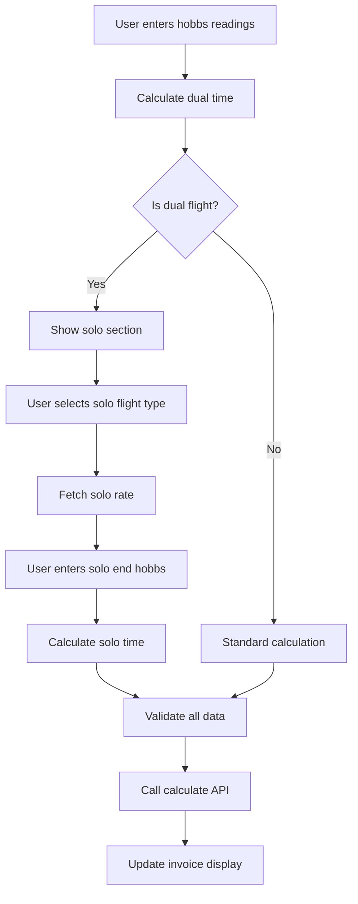

# Dual/Solo Flight Time Logging System

## Overview

This document provides a comprehensive overview of the dual/solo flight time logging system implemented in the flight booking application. The system allows instructors to log flights that transition from dual instruction (instructor + student) to solo flight (student only) within a single flight session, with separate billing rates for each portion.

## Table of Contents

1. [Business Requirements](#business-requirements)
2. [Database Schema](#database-schema)
3. [Component Architecture](#component-architecture)
4. [API Endpoints](#api-endpoints)
5. [Data Flow](#data-flow)
6. [UI/UX Design](#uiux-design)
7. [Billing Logic](#billing-logic)
8. [Technical Implementation](#technical-implementation)
9. [Error Handling & Validation](#error-handling--validation)
10. [Migration Guide](#migration-guide)

## Business Requirements

### Flight Types
- **Dual Flight**: Instructor and student fly together
- **Solo Flight**: Student flies alone
- **Dual→Solo Transition**: Single flight session that starts dual and transitions to solo

### Billing Requirements
- **Dual Time**: Charged for both aircraft and instructor at dual rates
- **Solo Time**: Charged for aircraft only at solo rates (no instructor charge)
- **Separate Rates**: Solo and dual portions can have different aircraft rates
- **Accurate Time Tracking**: Precise hobbs meter readings for each segment

### User Experience
- Intuitive interface that only shows solo options when relevant
- Real-time rate display and time calculations
- Clear validation messages for invalid configurations
- Automatic default selection for solo flight types

## Database Schema

### Updated Tables

#### `flight_logs` Table
```sql
-- Existing columns (preserved)
id, booking_id, checked_out_aircraft_id, checked_out_instructor_id
actual_start, actual_end, eta
hobbs_start, hobbs_end, tach_start, tach_end
flight_time_hobbs, flight_time_tach, flight_time
fuel_on_board, passengers, route, equipment
briefing_completed, authorization_completed, flight_remarks
created_at, updated_at

-- New columns for dual/solo tracking
solo_end_hobbs DECIMAL(10,1)    -- Final hobbs when student continues solo
dual_time DECIMAL(10,1)         -- Time with instructor present
solo_time DECIMAL(10,1)         -- Time flying solo
```

#### `flight_types` Table
```sql
-- Existing columns (preserved)
id, name, description, instruction_type, is_active
voided_at, created_at, updated_at

-- New column for default solo selection
is_default_solo BOOLEAN DEFAULT FALSE
```

### Key Relationships
- `flight_logs.booking_id` → `bookings.id`
- `flight_logs.checked_out_aircraft_id` → `aircraft.id`
- `flight_logs.checked_out_instructor_id` → `instructors.id`
- `aircraft_charge_rates.flight_type_id` → `flight_types.id`
- Solo flight type rates looked up via `aircraft_charge_rates`

### Constraints
```sql
-- Ensure only one default solo flight type
CREATE UNIQUE INDEX idx_flight_types_default_solo
ON flight_types (is_default_solo)
WHERE is_default_solo = TRUE AND instruction_type = 'solo';

-- Performance indexes
CREATE INDEX idx_flight_logs_dual_solo ON flight_logs(dual_time, solo_time);
```

## Component Architecture

### Core Components

#### 1. CheckInDetails (`src/components/bookings/CheckInDetails.tsx`)
**Purpose**: Main form component for flight check-in with dual/solo time logging

**Key Features**:
- Dual flight type and instructor selection
- Hobbs/tach meter input with start/end values
- Conditional solo section that appears for dual flights
- Solo flight type dropdown (filtered to solo types only)
- Real-time rate display for both dual and solo portions
- Time calculation with floating-point precision fixes

**State Management**:
```typescript
// Main flight configuration
const [selectedFlightType, setSelectedFlightType] = useState<string>("");
const [selectedInstructor, setSelectedInstructor] = useState<string>("");

// Solo-specific state
const [selectedSoloFlightType, setSelectedSoloFlightType] = useState<string>("");
const [soloEndHobbs, setSoloEndHobbs] = useState<string>("");
const [soloChargeRate, setSoloChargeRate] = useState<string | null>(null);
```

**Calculation Logic**:
```typescript
// Dual time: hobbs_end - hobbs_start
dualTime = roundToOneDecimal(parseFloat(endHobbs) - parseFloat(startHobbs));

// Solo time: solo_end_hobbs - hobbs_end (when provided)
if (soloEndHobbs && parseFloat(soloEndHobbs) > parseFloat(endHobbs)) {
  soloTime = roundToOneDecimal(parseFloat(soloEndHobbs) - parseFloat(endHobbs));
}
```

#### 2. BookingCheckInClient (`src/app/(auth)/dashboard/bookings/check-in/[id]/BookingCheckInClient.tsx`)
**Purpose**: Client-side wrapper that orchestrates the check-in process

**Responsibilities**:
- Data fetching and state management
- Integration with backend APIs
- Invoice display and management
- Success/failure handling

**Data Flow**:
```typescript
// Passes flight type context to CheckInDetails
<CheckInDetails
  flightType={booking?.flight_type}
  initialSoloEndHobbs={flightLog?.solo_end_hobbs}
  onCalculateCharges={handleCalculateCharges}
/>
```

#### 3. Check-In Page (`src/app/(auth)/dashboard/bookings/check-in/[id]/page.tsx`)
**Purpose**: Server-side page that fetches initial data and renders the check-in interface

**Data Fetching**:
- Booking details with flight logs
- Available instructors
- Flight type information
- Authorization status

### Supporting Components

#### Rate Management
- Fetches aircraft charge rates based on selected flight types
- Displays rates with tax calculations
- Validates rate availability before allowing calculations

#### Form Validation
- Ensures all required fields are completed
- Validates meter reading sequences (solo > dual)
- Provides real-time feedback on missing data

## API Endpoints

### Calculate Charges API (`/api/bookings/[id]/calculate-charges`)

**Purpose**: Processes dual/solo time calculations and creates invoice line items

**Request Interface**:
```typescript
interface CalculateChargesRequest {
  chargeTime: number;           // Total flight time
  aircraftRate: number;         // Dual aircraft rate
  instructorRate: number;       // Instructor rate
  chargingBy: 'hobbs' | 'tacho' | null;
  selectedInstructor: string;
  selectedFlightType: string;
  hobbsStart?: number;
  hobbsEnd?: number;
  tachStart?: number;
  tachEnd?: number;
  flightTimeHobbs: number;
  flightTimeTach: number;
  soloEndHobbs?: number;        // NEW: Solo end reading
  dualTime: number;             // NEW: Dual portion time
  soloTime: number;             // NEW: Solo portion time
  soloFlightType?: string;      // NEW: Solo flight type ID
  soloAircraftRate?: number;    // NEW: Solo aircraft rate
}
```

**Processing Logic**:
1. **Validation**: Verify user permissions and data integrity
2. **Flight Log Updates**: Store meter readings and calculated times
3. **Rate Lookup**: Fetch both dual and solo aircraft rates
4. **Invoice Generation**: Create or update invoice with line items
5. **Line Item Creation**: Separate items for dual vs solo charges

**Line Item Logic**:
```typescript
// Dual portion (aircraft + instructor)
if (dualTime > 0) {
  createLineItem("Dual Flight - Aircraft", dualTime, aircraftRate);
  createLineItem("Dual Flight - Instructor", dualTime, instructorRate);
}

// Solo portion (aircraft only)
if (soloTime > 0) {
  const soloRate = soloAircraftRate || aircraftRate;
  createLineItem("Solo Flight - Aircraft", soloTime, soloRate);
}
```

### Aircraft Charge Rates API (`/api/aircraft_charge_rates`)

**Purpose**: Retrieves pricing information for aircraft/flight-type combinations

**Usage in Dual/Solo System**:
- Dual rates: `aircraft_id` + `selectedFlightType`
- Solo rates: `aircraft_id` + `selectedSoloFlightType`
- Supports different pricing for dual vs solo operations

## Data Flow

### Complete Check-In Flow

1. **Page Load**:
   ```
   Server → Fetch booking + flight_logs + instructors
   Client → Initialize CheckInDetails with existing data
   ```

2. **User Input**:
   ```
   User enters hobbs readings → Dual time calculated
   Solo section appears → User selects solo flight type
   Solo rate fetched → Solo time calculated
   ```

3. **Rate Fetching**:
   ```
   Dual: /api/aircraft_charge_rates?aircraft_id=X&flight_type_id=Y
   Solo: /api/aircraft_charge_rates?aircraft_id=X&flight_type_id=Z
   ```

4. **Calculation Process**:
   ```
   Frontend → Calculate dual/solo times
   Frontend → Validate all required data
   Frontend → Call /api/bookings/[id]/calculate-charges
   Backend → Update flight_logs with times
   Backend → Create/update invoice line items
   Backend → Return updated invoice data
   ```

5. **UI Updates**:
   ```
   Optimistic updates → Show calculated line items
   Real data arrives → Replace with actual values
   Success state → Enable completion button
   ```

### State Management Flow



## UI/UX Design

### Conditional Display Logic

**Solo Section Visibility**:
```typescript
const showSoloInput = isDualInstructionFlight &&
                     endHobbs &&
                     !isNaN(parseFloat(endHobbs)) &&
                     parseFloat(endHobbs) > 0;
```

**Visual Design Elements**:
- **Blue-themed solo section** to distinguish from main form
- **Real-time calculations** showing dual/solo time breakdown
- **Rate display** with tax-inclusive/exclusive options
- **Validation messages** for missing or invalid data

### User Experience Features

1. **Smart Defaults**:
   - Auto-selects default solo flight type when section appears
   - Preserves user selections during form interactions

2. **Real-Time Feedback**:
   ```typescript
   // Time breakdown display
   {isDualInstructionFlight && dualTime > 0 ? (
     <div className="space-y-1">
       <div>Dual Time: {dualTime.toFixed(2)} hours</div>
       {soloTime > 0 && <div>Solo Time: {soloTime.toFixed(2)} hours</div>}
       <div className="font-semibold">Total: {totalTime.toFixed(2)} hours</div>
     </div>
   ) : (
     <div>Total: {isNaN(parseFloat(hobbsTotal)) ? '0.0' : hobbsTotal} hours</div>
   )}
   ```

3. **Progressive Disclosure**:
   - Solo options only appear when relevant
   - Rate information shown contextually
   - Validation errors displayed inline

## Billing Logic

### Line Item Creation

**Standard Dual Flight**:
```
- "Dual Training - VH-ABC" (1.2h × $150/h = $180.00)
- "Dual Training - John Smith" (1.2h × $80/h = $96.00)
Total: $276.00 + tax
```

**Dual→Solo Transition Flight**:
```
- "Dual Training - VH-ABC" (0.8h × $150/h = $120.00)
- "Dual Training - John Smith" (0.8h × $80/h = $64.00)
- "Solo Training - VH-ABC" (0.4h × $120/h = $48.00)
Total: $232.00 + tax
```

**Pure Solo Flight**:
```
- "Solo Training - VH-ABC" (1.0h × $120/h = $120.00)
Total: $120.00 + tax
```

### Rate Management

**Rate Lookup Priority**:
1. **Dual rates**: Use selected dual flight type
2. **Solo rates**: Use selected solo flight type (may differ from dual)
3. **Fallback**: Use dual rate if solo rate not available

**Tax Calculations**:
- All rates stored exclusive of tax
- Tax applied at invoice level (typically 15%)
- UI shows both inclusive and exclusive rates

## Technical Implementation

### Floating-Point Precision Handling

**Problem**: JavaScript floating-point arithmetic creates values like `0.40000000000009095`

**Solution**: Consistent rounding throughout the system
```typescript
const roundToOneDecimal = (value: number): number => {
  return Math.round(value * 10) / 10;
};

// Applied to all time calculations
dualTime = roundToOneDecimal(parseFloat(endHobbs) - parseFloat(startHobbs));
soloTime = roundToOneDecimal(parseFloat(soloEndHobbs) - parseFloat(endHobbs));
```

**Implementation Points**:
- Frontend calculations in `CheckInDetails.tsx`
- API storage in `calculate-charges/route.ts`
- Optimistic updates in `use-booking-check-in.ts`
- Database storage with rounded values

### Performance Optimizations

**React Optimization**:
```typescript
// Memoized calculations to prevent unnecessary re-renders
const { dualTime, soloTime, totalTime } = useMemo(() => {
  // Complex calculation logic
}, [endHobbs, startHobbs, soloEndHobbs, chargeHobbs, chargeTacho]);

// Memoized handlers to prevent prop drilling re-renders
const handleSoloFlightTypeChange = useCallback((value: string) => {
  setSelectedSoloFlightType(value);
}, []);
```

**Database Optimization**:
- Indexes on frequently queried columns
- Single database transaction for flight log updates
- Parallel execution of invoice item operations

### Error Handling

**Frontend Validation**:
```typescript
// Comprehensive validation checks
const hasValidData = aircraftRateExclusive &&
                    instructorRateExclusive &&
                    selectedInstructor &&
                    selectedFlightType &&
                    (!soloTime || (selectedSoloFlightType && soloAircraftRateExclusive));
```

**API Error Handling**:
- User permission validation
- Rate availability verification
- Database transaction rollback on failures
- Detailed error messages for debugging

**User Experience**:
- Real-time validation feedback
- Clear error messages
- Graceful degradation when rates unavailable

## Error Handling & Validation

### Frontend Validation Rules

1. **Required Fields**:
   - Flight type selection
   - Instructor selection
   - Valid aircraft and instructor rates

2. **Solo-Specific Validation**:
   - Solo flight type required when solo time > 0
   - Solo aircraft rate must be available
   - Solo end hobbs > dual end hobbs

3. **Meter Reading Validation**:
   - End readings must be greater than start readings
   - Solo end must be greater than dual end
   - Numeric values only

### Backend Validation

1. **Permission Checks**:
   - User can only modify own bookings (unless privileged)
   - Instructor/admin role verification

2. **Data Integrity**:
   - Flight log exists and belongs to booking
   - Aircraft and instructor IDs are valid
   - Rate configurations exist

3. **Business Logic Validation**:
   - Time calculations are logical
   - Rates are positive values
   - Flight type configurations are valid

### Error States

**Common Error Scenarios**:
- Missing aircraft charge rates for selected flight types
- Invalid meter reading sequences
- Network failures during rate fetching
- Database transaction failures

**User Feedback**:
- Inline validation messages
- Rate availability indicators
- Loading states during API calls
- Success confirmations

## Migration Guide

### Database Migration Steps

1. **Update flight_logs table**:
   ```sql
   ALTER TABLE flight_logs
   ADD COLUMN solo_end_hobbs DECIMAL(10,1),
   ADD COLUMN dual_time DECIMAL(10,1),
   ADD COLUMN solo_time DECIMAL(10,1);
   ```

2. **Update flight_types table**:
   ```sql
   ALTER TABLE flight_types
   ADD COLUMN is_default_solo BOOLEAN DEFAULT FALSE;
   ```

3. **Add constraints and indexes**:
   ```sql
   CREATE UNIQUE INDEX idx_flight_types_default_solo
   ON flight_types (is_default_solo)
   WHERE is_default_solo = TRUE AND instruction_type = 'solo';

   CREATE INDEX idx_flight_logs_dual_solo ON flight_logs(dual_time, solo_time);
   ```

4. **Set default solo flight type**:
   ```sql
   UPDATE flight_types
   SET is_default_solo = TRUE
   WHERE id = 'your-solo-flight-type-id' AND instruction_type = 'solo';
   ```

### Code Deployment

**Zero-Downtime Deployment**:
- All new columns are nullable
- Existing flight logs continue to work
- New features only activate with new data

**Rollback Strategy**:
- Database columns can be dropped if needed
- No existing data is modified during migration
- Feature flags could control new UI elements

### Configuration Requirements

1. **Flight Types**:
   - Ensure solo flight types exist
   - Set one as default via `is_default_solo = TRUE`
   - Configure aircraft charge rates for solo types

2. **Aircraft Charge Rates**:
   - Solo flight types need rate configurations
   - Can have different rates than dual types
   - Test rate lookup for all aircraft/flight-type combinations

3. **User Permissions**:
   - Instructors can check in all flights
   - Students can only check in own flights
   - Rate visibility based on user roles

## Conclusion

The dual/solo flight time logging system provides comprehensive support for aviation training scenarios where flights transition from dual instruction to solo practice. The implementation maintains data integrity, provides accurate billing, and offers an intuitive user experience while being technically robust and scalable.

The system's modular design allows for future enhancements such as:
- Additional flight type variations
- Complex rate structures
- Advanced reporting capabilities
- Integration with external aviation systems

For support or modifications, refer to the component documentation and API specifications outlined in this document.