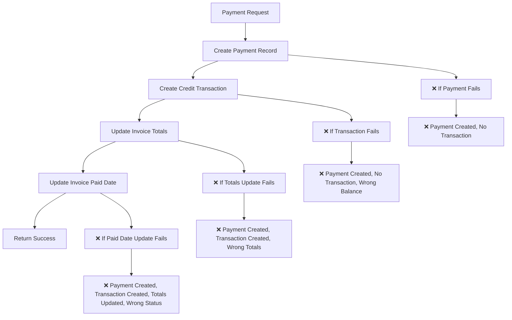

# Payment System Atomic Transaction Audit

## Executive Summary

The current payment system has **critical atomicity issues** that violate the principles established in our atomic transaction system. The payment processing is **NOT atomic** and can lead to data inconsistency, incorrect account balances, and orphaned records.

## Current Payment System Analysis

### 1. Payment Processing Flow (Current Implementation)



### 2. Critical Issues Identified

#### **Issue #1: Non-Atomic Operations**
- **Problem**: Payment creation involves 4 separate database operations
- **Risk**: If any operation fails, the system is left in an inconsistent state
- **Example**: Payment created but transaction fails → User charged but account balance not updated

#### **Issue #2: Missing Transaction Rollback**
- **Problem**: No rollback mechanism if later operations fail
- **Risk**: Partial payment processing leaves orphaned records
- **Example**: Payment and transaction created, but invoice totals update fails → Inconsistent data

#### **Issue #3: Race Conditions**
- **Problem**: Multiple operations without proper locking
- **Risk**: Concurrent payments could cause incorrect totals
- **Example**: Two payments processed simultaneously could result in wrong balance calculations

#### **Issue #4: Status Update Logic Issues**
- **Problem**: Invoice status not properly managed during payment processing
- **Risk**: Invoices may not transition to correct status (paid/overdue)
- **Example**: Payment made but invoice remains "pending" instead of "paid"

#### **Issue #5: Payment Method Enum Mismatch**
- **Problem**: Frontend uses different payment method values than database
- **Risk**: Payment method validation failures
- **Example**: Frontend sends "cheque" but database expects "check"

## Detailed Code Analysis

### 1. Payment API Endpoint (`/src/app/api/payments/route.ts`)

**Current Implementation Issues:**

```typescript
// ❌ NON-ATOMIC: 4 separate operations
try {
  // 1. Create payment record
  const { data: payment, error: paymentError } = await supabase
    .from('payments')
    .insert([{...}])
    .select()
    .single();

  // 2. Create credit transaction
  await TransactionService.createPaymentCredit({...});

  // 3. Update invoice totals
  await InvoiceService.updateInvoiceTotalsWithTransactionSync(invoice_id);

  // 4. Update invoice paid date
  await supabase
    .from('invoices')
    .update({ paid_date: new Date().toISOString() })
    .eq('id', invoice_id);
}
```

**Problems:**
- No transaction wrapper
- No rollback on failure
- No status validation
- No concurrency control

### 2. Payment Modal Component (`RecordPaymentModal.tsx`)

**Current Implementation Issues:**

```typescript
// ❌ Payment method mismatch
const paymentMethods = [
  { value: "cheque", label: "Cheque", icon: Receipt }, // Frontend uses "cheque"
  // ... other methods
];

// Database enum values:
// 'cash', 'credit_card', 'debit_card', 'bank_transfer', 'check', 'online_payment', 'other'
// Database uses "check" but frontend sends "cheque"
```

**Problems:**
- Payment method enum mismatch
- No validation of payment amount against invoice balance
- No handling of partial payments
- No status update logic

### 3. Type Definitions (`/src/types/payments.ts`)

**Current Implementation Issues:**

```typescript
// ❌ Missing transaction_id in Payment interface
export interface Payment {
  id: string;
  invoice_id: string;
  transaction_id: string; // This field exists in DB but not used properly
  amount: string; // Should be number for calculations
  payment_method: PaymentMethod;
  // ... other fields
}

// ❌ PaymentMethod enum doesn't match database
export type PaymentMethod =
  | 'cash'
  | 'credit_card'
  | 'bank_transfer'
  | 'direct_debit'  // Not in database
  | 'cheque'        // Database uses 'check'
  | 'other';
```

## Required Changes

### 1. Create Atomic Payment Processing Function

**Database Function: `process_payment_atomic()`**

```sql
CREATE OR REPLACE FUNCTION process_payment_atomic(
  p_invoice_id UUID,
  p_amount NUMERIC,
  p_payment_method TEXT,
  p_payment_reference TEXT DEFAULT NULL,
  p_notes TEXT DEFAULT NULL
) RETURNS JSONB
LANGUAGE plpgsql
AS $$
DECLARE
  v_invoice RECORD;
  v_payment_id UUID;
  v_transaction_id UUID;
  v_remaining_balance NUMERIC;
  v_new_status TEXT;
  v_result JSONB;
BEGIN
  -- Start transaction
  BEGIN
    -- Get invoice details with lock
    SELECT * INTO v_invoice
    FROM invoices 
    WHERE id = p_invoice_id
    FOR UPDATE;
    
    IF NOT FOUND THEN
      RETURN jsonb_build_object(
        'success', false,
        'error', 'Invoice not found',
        'invoice_id', p_invoice_id
      );
    END IF;
    
    -- Validate payment amount
    IF p_amount <= 0 THEN
      RETURN jsonb_build_object(
        'success', false,
        'error', 'Payment amount must be positive',
        'invoice_id', p_invoice_id
      );
    END IF;
    
    -- Calculate remaining balance
    SELECT COALESCE(v_invoice.total_amount - COALESCE(SUM(amount), 0), v_invoice.total_amount)
    INTO v_remaining_balance
    FROM payments
    WHERE invoice_id = p_invoice_id;
    
    -- Validate payment doesn't exceed remaining balance
    IF p_amount > v_remaining_balance THEN
      RETURN jsonb_build_object(
        'success', false,
        'error', 'Payment amount exceeds remaining balance',
        'remaining_balance', v_remaining_balance,
        'invoice_id', p_invoice_id
      );
    END IF;
    
    -- Create credit transaction first
    INSERT INTO transactions (
      user_id,
      type,
      amount,
      description,
      metadata,
      status,
      completed_at
    ) VALUES (
      v_invoice.user_id,
      'credit',
      p_amount,
      'Payment for invoice: ' || v_invoice.invoice_number,
      jsonb_build_object(
        'invoice_id', p_invoice_id,
        'invoice_number', v_invoice.invoice_number,
        'transaction_type', 'payment_credit'
      ),
      'completed',
      NOW()
    ) RETURNING id INTO v_transaction_id;
    
    -- Create payment record
    INSERT INTO payments (
      invoice_id,
      transaction_id,
      amount,
      payment_method,
      payment_reference,
      notes
    ) VALUES (
      p_invoice_id,
      v_transaction_id,
      p_amount,
      p_payment_method::payment_method,
      p_payment_reference,
      p_notes
    ) RETURNING id INTO v_payment_id;
    
    -- Update invoice totals
    UPDATE invoices 
    SET 
      total_paid = total_paid + p_amount,
      balance_due = total_amount - (total_paid + p_amount),
      updated_at = NOW()
    WHERE id = p_invoice_id;
    
    -- Determine new status
    v_remaining_balance := v_remaining_balance - p_amount;
    
    IF v_remaining_balance <= 0 THEN
      v_new_status := 'paid';
      UPDATE invoices 
      SET 
        status = 'paid'::invoice_status,
        paid_date = NOW(),
        updated_at = NOW()
      WHERE id = p_invoice_id;
    ELSE
      v_new_status := v_invoice.status;
    END IF;
    
    -- Return success result
    RETURN jsonb_build_object(
      'success', true,
      'payment_id', v_payment_id,
      'transaction_id', v_transaction_id,
      'invoice_id', p_invoice_id,
      'new_status', v_new_status,
      'remaining_balance', v_remaining_balance,
      'message', 'Payment processed atomically'
    );
    
  EXCEPTION
    WHEN OTHERS THEN
      -- Any error will cause the entire transaction to rollback
      RETURN jsonb_build_object(
        'success', false,
        'error', SQLERRM,
        'invoice_id', p_invoice_id,
        'message', 'Payment processing rolled back due to error'
      );
  END;
END;
$$;
```

### 2. Update Payment API Endpoint

**New Implementation:**

```typescript
export async function POST(req: NextRequest) {
  const supabase = await createClient();
  
  // ... auth checks ...
  
  const { invoice_id, amount, payment_method, payment_reference, notes } = parseResult.data;

  try {
    // Use atomic database function
    const { data: result, error } = await supabase.rpc('process_payment_atomic', {
      p_invoice_id: invoice_id,
      p_amount: Number(amount),
      p_payment_method: payment_method,
      p_payment_reference: payment_reference || null,
      p_notes: notes || null
    });
    
    if (error) {
      console.error('Payment processing error:', error);
      return NextResponse.json({ error: error.message }, { status: 500 });
    }
    
    if (!result.success) {
      console.error('Payment processing failed:', result.error);
      return NextResponse.json({ error: result.error }, { status: 400 });
    }
    
    console.log(`Payment processed atomically: ${result.payment_id} for invoice ${result.invoice_id}`);
    console.log(`Invoice status: ${result.new_status}, Remaining balance: ${result.remaining_balance}`);
    
    return NextResponse.json({ 
      id: result.payment_id,
      transaction_id: result.transaction_id,
      invoice_id: result.invoice_id,
      new_status: result.new_status,
      remaining_balance: result.remaining_balance,
      message: result.message
    });
  } catch (error) {
    console.error('Payment creation error:', error);
    return NextResponse.json({ 
      error: error instanceof Error ? error.message : 'Failed to process payment' 
    }, { status: 500 });
  }
}
```

### 3. Fix Payment Method Enum Mismatch

**Update Frontend Payment Methods:**

```typescript
const paymentMethods = [
  { value: "cash", label: "Cash", icon: DollarSign },
  { value: "credit_card", label: "Credit Card", icon: CreditCard },
  { value: "debit_card", label: "Debit Card", icon: CreditCard },
  { value: "bank_transfer", label: "Bank Transfer", icon: Landmark },
  { value: "check", label: "Check", icon: Receipt }, // Changed from "cheque"
  { value: "online_payment", label: "Online Payment", icon: Wallet },
  { value: "other", label: "Other", icon: Wallet },
];
```

**Update Type Definitions:**

```typescript
export type PaymentMethod =
  | 'cash'
  | 'credit_card'
  | 'debit_card'
  | 'bank_transfer'
  | 'check'        // Changed from 'cheque'
  | 'online_payment'
  | 'other';
```

### 4. Add Payment Validation

**Update Payment Modal:**

```typescript
// Add validation for payment amount
const validatePaymentAmount = (amount: number, balanceDue: number) => {
  if (amount <= 0) {
    return "Payment amount must be greater than zero";
  }
  if (amount > balanceDue) {
    return `Payment amount cannot exceed remaining balance of $${balanceDue.toFixed(2)}`;
  }
  return null;
};

// Add validation in form submission
const handleSubmit = async (e: React.FormEvent) => {
  e.preventDefault();
  setError(null);
  
  const validationError = validatePaymentAmount(amount, balanceDue);
  if (validationError) {
    setError(validationError);
    return;
  }
  
  // ... rest of submission logic
};
```

## Implementation Plan

### Phase 1: Database Function Creation (1 day)
1. Create `process_payment_atomic()` function
2. Test function with various scenarios
3. Verify atomicity and rollback behavior

### Phase 2: API Endpoint Update (1 day)
1. Update payment API to use atomic function
2. Remove old non-atomic logic
3. Add proper error handling and logging

### Phase 3: Frontend Updates (1 day)
1. Fix payment method enum mismatch
2. Add payment validation
3. Update error handling
4. Test payment flow end-to-end

### Phase 4: Testing & Verification (1 day)
1. Test atomic payment processing
2. Test error scenarios and rollback
3. Test concurrent payments
4. Verify account balance accuracy

## Testing Scenarios

### 1. Successful Payment Processing
- Full payment (invoice becomes paid)
- Partial payment (invoice remains pending)
- Multiple payments on same invoice

### 2. Error Scenarios
- Invalid invoice ID
- Payment amount exceeds balance
- Database connection failure
- Constraint violations

### 3. Concurrency Testing
- Multiple simultaneous payments
- Payment while invoice is being updated
- Race condition scenarios

### 4. Data Integrity Verification
- Account balance accuracy
- Invoice status correctness
- Transaction record completeness
- Payment-total consistency

## Expected Benefits

### 1. Data Integrity
- **100% Atomic Operations**: All payment processing succeeds or fails completely
- **No Orphaned Records**: Impossible to have payment without transaction
- **Consistent Account Balances**: User balances always accurate

### 2. Reliability
- **Automatic Rollback**: Failed operations don't leave system in inconsistent state
- **Concurrency Safety**: Multiple payments handled correctly
- **Error Recovery**: Clear error messages and proper handling

### 3. Maintainability
- **Single Source of Truth**: All payment logic in database function
- **Easier Debugging**: Clear audit trail and error messages
- **Simplified Testing**: Atomic operations easier to test

## Conclusion

The current payment system has **critical atomicity issues** that must be addressed to ensure data integrity. The proposed atomic transaction approach will eliminate all current issues and provide a robust, reliable payment processing system that aligns with our overall atomic transaction architecture.

**Priority**: **HIGH** - This should be implemented immediately to prevent data corruption and ensure financial accuracy.
